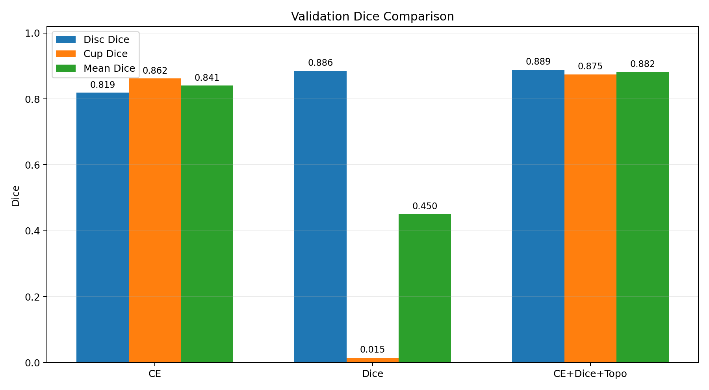
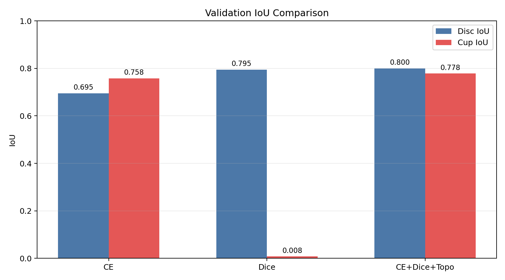
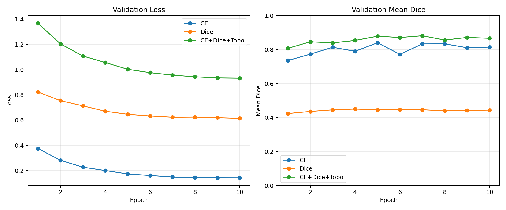
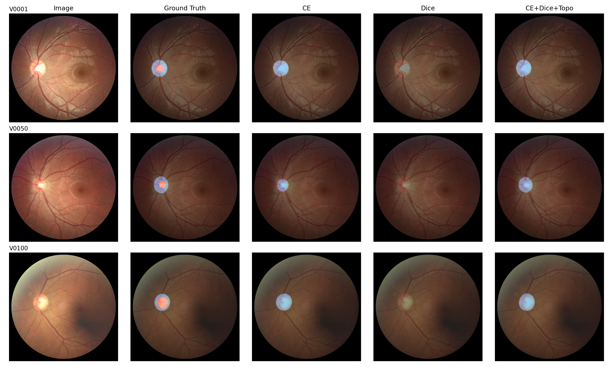
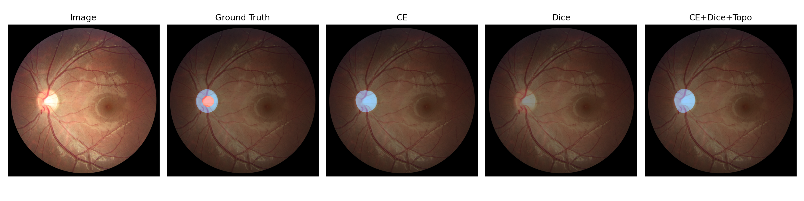
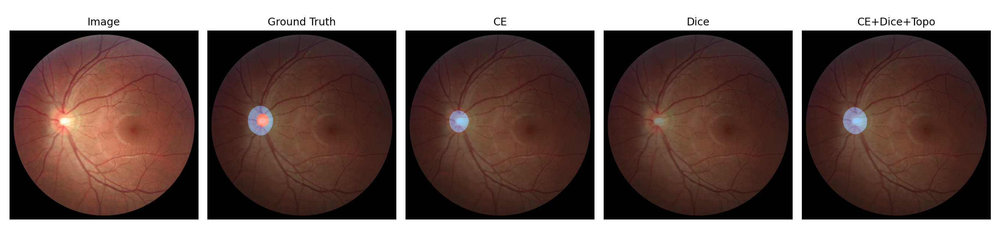

# REFUGE 视盘/视杯分割项目汇报报告

## 1. 汇报主线

本项目完成 REFUGE 眼底图像中的视盘和视杯分割。汇报重点包括：数据集认识、分割任务和分类任务的差异、网络结构选择、损失函数实验、H100 训练设置、评估指标、预测可视化，以及最终结论。

本次最终训练使用 **H100 GPU**。H100 的显存和 Tensor Core 能力使 ConvNeXt-Large 级别模型可以使用较高输入分辨率 `768 x 768` 和 batch size 12 进行训练。训练阶段开启 AMP 混合精度以降低显存占用并提升吞吐。

## 2. 任务与数据集

REFUGE 是眼底图像视盘/视杯分割数据集。本项目将标签统一映射成三类：

| 类别 | 含义 | 原始标签值 |
| --- | --- | --- |
| 0 | 背景 | 255 |
| 1 | 视盘 optic disc | 128 |
| 2 | 视杯 optic cup | 0 |

视盘通常是图像中较亮、近圆形、血管汇聚的区域；视杯位于视盘内部，面积更小。视杯/视盘结构关系非常重要：正常情况下视杯应包含在视盘内部，因此本项目还加入了拓扑约束和后处理。

## 3. 模型选择

本项目采用 **RFAU-CNxt 风格 ConvNeXt-UNet**：

- 编码器使用 ConvNeXt-Large，负责提取强语义特征。
- 解码器采用 U-Net 风格逐级上采样，恢复空间分辨率。
- 跳跃连接保留低层边界和纹理信息。
- 注意力式 skip fusion 强化关键区域。

选择该模型的原因：

1. 医学图像分割常需要精细边界，U-Net 类编码器-解码器结构非常适合。
2. ConvNeXt 比普通 CNN 编码器表达能力更强。
3. 相比纯 Transformer，ConvNeXt-UNet 训练更稳定、工程实现更直接。
4. 对 REFUGE 这种视盘/视杯任务，局部纹理和全局结构都重要。

## 4. 分割任务和分类任务的差异

分类任务输出通常是 `[B, C]`，表示整张图片属于哪个类别。分割任务输出是 `[B, C, H, W]`，表示每个像素属于哪个类别。本项目输出 3 类像素级 logits：背景、视盘、视杯。

分割任务的关键差异：

- 标签是二维 mask，而不是单个类别 id。
- loss 按像素或区域计算。
- 指标使用 Dice、IoU 等区域重叠指标。
- 小目标类别容易被背景淹没，需要处理类别不均衡。
- 医学结构可能有拓扑约束，例如视杯必须在视盘内部。

## 5. 实验设置

所有已完成实验均使用 H100 训练，主要设置如下：

| 设置项 | 值 |
| --- | --- |
| 模型 | RFAU-CNxt 风格 ConvNeXt-UNet |
| GPU | H100 |
| 输入尺寸 | 768 x 768 |
| Epoch | 10 |
| Batch Size | 12 |
| Workers | 24 |
| Optimizer | AdamW |
| Learning Rate | 1e-4 |
| Scheduler | Cosine |
| AMP | 开启 |

实验对比三种损失函数：

| 实验 | 损失函数 | 目的 |
| --- | --- | --- |
| CE | Cross Entropy | 观察逐像素分类监督效果 |
| Dice | Dice Loss | 观察区域重叠优化效果 |
| CE+Dice+Topo | CE + Dice + Topology | 综合像素监督、区域重叠和结构先验 |

## 6. 定量结果

最佳轮次按照 `Mean Dice = (Disc Dice + Cup Dice) / 2` 选择。

| 实验 | 最佳轮 | Val Loss | Disc Dice | Cup Dice | Mean Dice | Disc IoU | Cup IoU | 训练时长 |
| --- | ---: | ---: | ---: | ---: | ---: | ---: | ---: | ---: |
| Cross Entropy | 5 | 0.1737 | 0.8193 | 0.8621 | 0.8407 | 0.6952 | 0.7582 | 6.87 min |
| Dice Loss | 4 | 0.6707 | 0.8856 | 0.0152 | 0.4504 | 0.7948 | 0.0077 | 6.86 min |
| CE + Dice + Topology | 7 | 0.9570 | 0.8889 | 0.8749 | 0.8819 | 0.8003 | 0.7785 | 6.84 min |

## 7. 训练过程分析

下图对比了三种损失函数的验证集 loss 和 mean Dice 变化。

从曲线和结果可以看出：

- CE 的训练较稳定，Cup Dice 表现较好，但 Disc Dice 不如组合损失。
- Dice Loss 对视盘区域有一定效果，但视杯 Dice 接近 0，说明单独 Dice 对小目标视杯优化不稳定。
- CE+Dice+Topology 在 Disc 和 Cup 两类上都较均衡，取得最高 Mean Dice。

## 8. 损失函数分析

### 8.1 Cross Entropy

CE 是逐像素分类损失，每个像素都会贡献梯度，因此训练早期更稳定。实验中 CE 的 Cup Dice 达到 0.8621，说明它能有效学习视杯类别。但 CE 不直接优化区域重叠，因此 Disc Dice 只有 0.8193，低于组合损失。

### 8.2 Dice Loss

Dice Loss 直接优化预测区域和真实区域的重叠度，理论上适合医学分割。但本实验中 Dice-only 的 Cup Dice 只有 0.0152，说明它对视杯这种小区域非常不稳定。可能原因是训练初期预测区域质量差，Dice 梯度对小目标较敏感，导致模型更偏向学习较大的视盘区域。

### 8.3 CE + Dice + Topology

组合损失取得最佳效果，Mean Dice 为 0.8819。其中 CE 提供稳定像素监督，Dice 优化区域重叠，Topology 约束利用视杯必须位于视盘内部这一医学先验。该组合使 Disc Dice 达到 0.8889，Cup Dice 达到 0.8749。

## 9. 预测可视化

下图展示验证集样本的原图、真实标签和三种损失函数下的预测结果。

单样本详细对比：

图中蓝色区域表示视盘，红色区域表示视杯。CE+Dice+Topology 的预测整体更接近真实标签，结构也更合理。Dice-only 的结果更容易出现视杯缺失或不稳定。

## 10. 后处理与拓扑约束

本项目实现了三类后处理：

1. 孔洞填补：修复预测区域内部出现的空洞。
2. 最大连通域：每类只保留最大区域，去除孤立噪声。
3. 视杯-视盘约束：去除脱离视盘区域的视杯预测。

拓扑损失采用可微形式，对 `P(cup) > P(disc)` 的区域施加惩罚，因此能够参与反向传播。这个约束符合医学先验：视杯应该位于视盘内部。

## 11. 项目不足

当前实验主要完成了课程要求中最核心的 loss 对比。仍有两点不足：

- 参数调优实验没有完整训练输出，报告中只保留实验设计，不纳入定量比较。
- SegFormer 对照实验没有完整产物，暂不能进行模型结构级定量比较。

此外，训练只进行了 10 个 epoch。若进一步增加 epoch、加入 ROI 裁剪和更系统的数据增强，模型性能仍可能提升。

## 12. 最终结论

本项目完成了 REFUGE 视盘/视杯分割任务，构建了 RFAU-CNxt 风格 ConvNeXt-UNet，并比较了 CE、Dice 和 CE+Dice+Topology 三种损失函数。实验表明，CE+Dice+Topology 取得最佳综合效果，Mean Dice = 0.8819，Disc Dice = 0.8889，Cup Dice = 0.8749。

最终结论是：对于视盘/视杯这类医学图像小目标分割任务，仅使用单一损失函数不够稳定；结合像素级监督、区域重叠优化和医学拓扑先验，能够获得更可靠的分割结果。

## 13. Pre 汇报建议

建议汇报顺序：

1. 介绍 REFUGE 任务和视盘/视杯定义。
2. 解释为什么选择 ConvNeXt-UNet。
3. 说明分割任务和分类任务代码差异。
4. 展示三种损失函数设置。
5. 展示 Dice/IoU 指标柱状图。
6. 展示训练曲线。
7. 展示预测可视化。
8. 总结 CE+Dice+Topology 最优，并解释原因。
